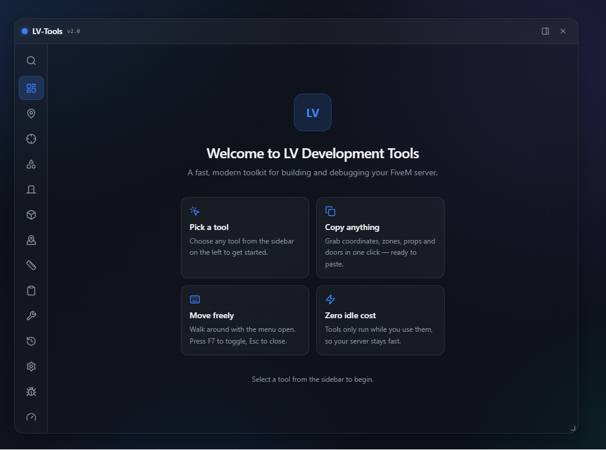

# LV-Tools v2

**A modern, UI-driven developer toolkit for FiveM.**

LV-Tools replaces scattered `/coords`, `/tp`, and raycast commands with one fast, floating NUI window. Built with **React + TypeScript** on the frontend and a modular **Lua** backend that stays at **0.00ms while idle**.

Works on **qb-core**, **Qbox**, **ESX**, or fully **standalone**.

<p align="center">
  
</p>

---

## Table of Contents

- [Features](#features)
- [Screenshots](#screenshots)
- [Requirements](#requirements)
- [Installation](#installation)
- [Usage](#usage)
- [Configuration](#configuration)
- [Door Lock Creator](#door-lock-creator)
- [Browser Dev Mode](#browser-dev-mode)
- [Building the UI](#building-the-ui)
- [Server Exports](#server-exports)
- [Project Structure](#project-structure)
- [Contributing](#contributing)
- [License](#license)

---

## Features

### Tools

| Tool | Description |
|------|-------------|
| **Dashboard** | Welcome screen with quick-start instructions for new users. |
| **Coordinates** | Live position with one-click copy in every format — `vector2/3/4`, heading, JSON, Lua, qb-target, ox_target, PolyZone, Box/Circle/Combo zone, spawn, `/tp`. |
| **Raycast** | Toggleable world raycast with in-world line, crosshair, and live hit data. Copy the hit with **E** (Vector3) or **Q** (Vector4). |
| **Polyzones** | Visual creator for Box, Circle, Poly, Combo, Entity, and Dynamic zones. Live preview, per-zone delete, clear all, and Lua export. |
| **Door Locks** | **Universal door lock maker** — aim at doors, capture them, assign jobs, then export ready-to-paste config for **qb-doorlocks**, **esx_doorlock**, or **ox_doorlock** (Qbox). |
| **Props** | Spawn, freeze, copy, delete, and export GTA objects at the crosshair or in front of the player. |
| **Markers** | Place and manage world markers with live preview. |
| **Measurements** | Distance, horizontal span, height, slope, total path length, and polygon area. |
| **Clipboard** | History of everything you've copied, with pin and favorite support. |
| **Utilities** | Quick dev actions — heal, armor, revive, noclip, freeze, invisible, repair vehicle, delete nearby entities. All server-validated. |
| **History** | Session log of copies and edits. |
| **Performance** | Live FPS, frame time, Lua memory, and resource count. |
| **Debug** | Toggle in-world overlays — entity IDs, vehicle IDs, zone names, heading, collision, bounding boxes. |
| **Settings** | Accent color, opacity, font size, notifications, autosave, raycast distance, overlay scale, and more. |

### Highlights

- **State-machine architecture** — expensive per-frame loops only run for the active tool. Idle cost is effectively zero.
- **Floating, dockable window** — draggable, resizable, remembers your layout between sessions.
- **Move while open** — walk around and reposition yourself without closing the toolkit. UI clicks won't fire your weapon.
- **Glassy dark UI** — translucent panel with blue accents, keyboard and mouse friendly.
- **Framework-agnostic** — auto-detects qb-core, Qbox, or ESX. Works standalone with no framework at all.
- **Permission system** — ACE, framework admin groups, license whitelist, or standalone mode.
- **Browser dev mode** — build and preview the full UI outside FiveM with mocked data.

---

## Requirements

| Dependency | Required | Notes |
|------------|----------|-------|
| FiveM server | Yes | Build 3095+ recommended |
| [PolyZone](https://github.com/mkafrin/PolyZone) | Yes | Required for the Polyzones tool |
| qb-core / Qbox / ESX | No | Optional — auto-detected when present |
| Node.js 18+ | No | Only needed to rebuild the UI. A prebuilt bundle is included. |

---

## Installation

1. Download or clone this repository.
2. Place the `lv-tools` folder in your server's `resources/` directory.
3. Add it to your `server.cfg` **after** your framework and PolyZone:

```cfg
ensure PolyZone
ensure qb-core        # or qbx_core / es_extended — optional
ensure lv-tools
```

4. Grant access (default permission mode is `ace`):

```cfg
add_ace group.admin lv-tools.access allow
add_principal identifier.license:xxxxxxxx group.admin
```

5. Restart the server and press **F7** (default) in-game to open the toolkit.

No build step is required — the prebuilt UI ships in `ui/dist/`.

---

## Usage

### Opening the toolkit

| Action | Default key |
|--------|-------------|
| Open / close toolkit | `F7` |
| Command palette | `F8` |
| Copy raycast hit as Vector3 | `E` (while raycast is enabled) |
| Copy raycast hit as Vector4 | `Q` (while raycast is enabled) |
| Capture door (aim mode) | `E` |
| Exit door aim mode | `Backspace` |

Rebind any key in `shared/config.lua` or through FiveM's key binding settings.

### Tips

- The toolkit keeps game input alive while open — you can walk around without closing the window.
- Click a tool in the sidebar to activate it. Only the active tool runs expensive loops.
- Use the **Settings** tab to customize appearance, notifications, autosave, and tool defaults.
- Press `Escape` or click the close button to dismiss the toolkit.

---

## Configuration

All server-side settings live in [`shared/config.lua`](shared/config.lua).

### Keybinds

```lua
Config.OpenKey = 'F7'
Config.CommandPaletteKey = 'F8'
```

### Framework

```lua
-- Auto-detect, or force a specific framework.
Config.Framework = 'auto'  -- 'auto' | 'qbcore' | 'qbox' | 'esx' | 'standalone'

-- Override resource names if you renamed them.
Config.Frameworks = {
    qbcore = { resource = 'qb-core' },
    qbox   = { resource = 'qbx_core' },
    esx    = { resource = 'es_extended' },
}
```

### Permissions

```lua
Config.PermissionMode = 'ace'  -- 'ace' | 'qbcore' | 'qbox' | 'esx' | 'license' | 'standalone' | 'auto'
Config.AcePermission  = 'lv-tools.access'  -- ACE admins always pass in every mode

Config.QBCorePermission = 'admin'
Config.QboxPermission   = 'admin'
Config.ESXPermission    = 'admin'

Config.Licenses = {
    -- ['license:xxxxxxxxxxxxxxxxxxxxxxxxxxxxxxxxxxxxxxxx'] = true,
}

Config.StandaloneAllowAll = false  -- set true on dev servers only
```

| Mode | How access is granted |
|------|----------------------|
| `ace` | Player has the ACE permission (`lv-tools.access` by default) |
| `qbcore` / `qbox` / `esx` | Player has the configured admin group in that framework |
| `license` | Player's license is in `Config.Licenses` |
| `standalone` | Controlled by `Config.StandaloneAllowAll` |
| `auto` | Uses the detected framework's admin check |

### Jobs (Door Lock Creator)

Jobs are pulled live from your framework. You can also provide a manual fallback list:

```lua
Config.Jobs = {
    source = 'auto',  -- 'auto' = read from framework, 'manual' = always use list below
    list = {
        { name = 'police',    label = 'Police' },
        { name = 'ambulance', label = 'EMS' },
        { name = 'mechanic',  label = 'Mechanic' },
    },
}
```

### Door name lookup

Captured doors auto-fill `objName` from `Config.DoorNames`. Add your own door prop hashes there — unknown props fall back to `objHash` on export.

### Raycast defaults

```lua
Config.Raycast = {
    distance = 50.0,
    drawLine = true,
    drawMarker = true,
    drawCrosshair = true,
}
```

### Door lock defaults

```lua
Config.Doorlock = {
    defaultDistance = 1.5,
    defaultLocked = true,
    defaultPickable = false,
}
```

---

## Door Lock Creator

A universal workflow for building door lock config entries without hand-writing coordinates. Export the same captured doors for **QBCore**, **ESX**, or **Qbox** — just flip the format selector.

1. Open the toolkit and go to the **Door Locks** tab.
2. Pick your **export format**: QBCore (`qb-doorlocks`), ESX (`esx_doorlock`), or Qbox (`ox_doorlock`).
3. Click **Start aiming** — this releases the cursor so you can look around.
4. Point at a door and press **E** to capture it. Press **Backspace** to exit aim mode.
5. For each captured door, edit:
   - `objName` / `objYaw`
   - `textCoords` — use **Set here** to drop it at your current position
   - `authorizedJobs` — click job chips from your framework, or add custom jobs
   - `locked`, `pickable`, `distance`
6. **Copy** a single entry or **Export all**, then paste into your door lock resource.

### Output formats

**QBCore** — `qb-doorlocks` (`Config.DoorList`):

```lua
{
    objName = 'v_ilev_ph_gendoor004',
    objYaw = 90.0,
    objCoords  = vec3(450.13, -986.88, 30.69),
    textCoords = vec3(450.13, -986.88, 30.69),
    authorizedJobs = { 'police' },
    locked = true,
    pickable = false,
    distance = 1.5,
},
```

**ESX** — `esx_doorlock` (`Config.DoorList`):

```lua
{
    objName = 'v_ilev_ph_gendoor004',
    objYaw = 90.0,
    objCoords  = vector3(450.13, -986.88, 30.69),
    textCoords = vector3(450.13, -986.88, 30.69),
    authorizedJobs = { 'police' },
    locked = true,
    distance = 1.5,
},
```

**Qbox** — `ox_doorlock` (door data object):

```lua
{
    name = 'v_ilev_ph_gendoor004',
    coords = vec3(450.13, -986.88, 30.69),
    model = `v_ilev_ph_gendoor004`,
    heading = 90.0,
    state = 1,
    maxDistance = 1.5,
    groups = { police = 0 },
    lockpick = false,
},
```

> `state` maps `locked` (1 = locked, 0 = unlocked) and `lockpick` maps `pickable`, following the ox_doorlock schema.

---

## Browser Dev Mode

Run the UI in a normal browser with all FiveM calls mocked. Ideal for development, theming, and taking clean screenshots.

```bash
cd ui
npm install
npm run dev
```

Open **http://localhost:5173/** — every panel is populated with mock data and fully interactive.

### Taking screenshots for this README

1. Run `npm run dev` and open the local URL.
2. Navigate to the tab you want to capture.
3. Take a screenshot:
   - **Windows:** `Win + Shift + S`
   - **macOS:** `Cmd + Shift + 4`
4. Save to `docs/images/` as `dashboard.png`, `raycast.png`, `doorlocks.png`, etc.
5. Stop the dev server with `Ctrl + C` when done.

---

## Building the UI

A prebuilt bundle is committed to `ui/dist/` so the resource works immediately after cloning. Rebuild only when you've changed the UI source:

```bash
cd ui
npm install
npm run build
```

Output goes to `ui/dist/`, which `fxmanifest.lua` serves as the NUI page.

---

## Server Exports

```lua
-- Check if a player has toolkit access
local hasAccess = exports['lv-tools']:HasAccess(source)

-- Open the toolkit for a player (server-triggered)
exports['lv-tools']:OpenUI(source)

-- Send a toast notification to a player's UI
exports['lv-tools']:Notify(source, 'Zone saved!', 'success')
```

---

## Project Structure

```
lv-tools/
├── fxmanifest.lua          # Resource manifest
├── LICENSE
├── README.md
├── CHANGELOG.md
├── shared/
│   ├── config.lua          # All configuration
│   ├── enums.lua           # Shared constants and tab IDs
│   └── utils.lua           # Shared helpers
├── client/
│   ├── state.lua           # State machine — activates modules per tab
│   ├── nui.lua             # NUI bridge (Lua ↔ React)
│   ├── main.lua            # Bootstrap and tick loop
│   ├── coords.lua          # Coordinates tool
│   ├── raycast.lua         # Raycast tool
│   ├── polyzones.lua       # PolyZone creator
│   ├── doorlocks.lua       # Door lock creator
│   ├── props.lua           # Prop spawner
│   ├── markers.lua         # Marker placer
│   ├── measurements.lua    # Measurement tool
│   ├── clipboard.lua       # Clipboard history
│   ├── debug.lua           # Debug overlays
│   └── ...
├── server/
│   ├── framework.lua       # Framework detection and abstraction
│   ├── permissions.lua     # Permission checks
│   ├── save.lua            # JSON persistence
│   ├── exports.lua         # Server exports
│   └── main.lua
├── data/                   # Runtime JSON (zones, props, etc.)
└── ui/
    ├── src/
    │   ├── components/     # React components
    │   │   └── panels/     # One panel per tool
    │   ├── store/          # Zustand state management
    │   ├── lib/            # NUI bridge and browser mocks
    │   └── types/          # TypeScript definitions
    └── dist/               # Prebuilt production bundle
```

### Architecture

```
┌─────────────┐     NUI callbacks      ┌──────────────┐
│  React UI   │ ◄──────────────────► │  client/nui  │
│  (ui/dist)  │     SendNUIMessage   │              │
└─────────────┘                      └──────┬───────┘
                                            │
                                     ┌──────▼───────┐
                                     │ client/state │  ← activates one module per tab
                                     └──────┬───────┘
                                            │
                              ┌─────────────┼─────────────┐
                              ▼             ▼             ▼
                         coords.lua    raycast.lua   doorlocks.lua  ...
```

Each tool is a self-contained `client/*.lua` module. The state machine only ticks the active module, keeping idle performance at zero. The UI mirrors this with one React panel per tool.

---

## Contributing

Pull requests are welcome.

- **Lua:** Add a new `client/yourtool.lua`, register it in `client/state.lua` and `client/nui.lua`, and add the tab to `shared/enums.lua`.
- **UI:** Add a panel under `ui/src/components/panels/`, wire it in `App.tsx` and `Sidebar.tsx`, and add types in `ui/src/types/`.
- **Mocks:** Update `ui/src/lib/mock.ts` so browser dev mode stays interactive.

Please keep changes focused and match the existing code style.

---

## License

Released under the [MIT License](LICENSE).

Free for personal and commercial use.

---

<p align="center">
  <sub>Built by <strong>LVDevelopment</strong></sub>
</p>
